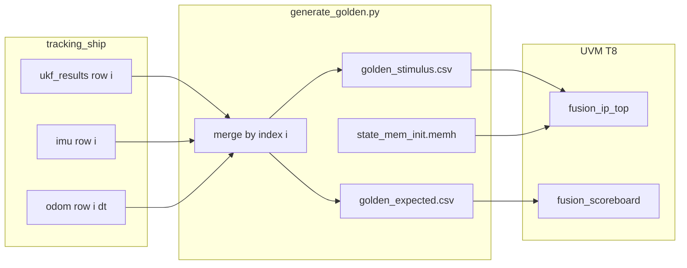

# Kế hoạch: Khớp golden – DUT với dt lớn (62s)

## Bối cảnh đã rõ trong repo

- [`scripts/generate_golden.py`](scripts/generate_golden.py): merge theo **cùng chỉ số dòng** `i` giữa `ukf_results_case{N}.csv`, `imu_measurement.csv`, `odometer_measurement.csv`; **`dt` lấy từ `odometer_measurement.csv`** (và được ghi vào `golden_stimulus.csv` cột `dt` / `dt_hex`). Các ước lượng 5 state trong `golden_expected.csv` lấy từ `ukf_results` qua `est_speed`, `est_heading`, `est_yaw_rate` — **nếu thiếu cột thì `.get(..., 0)` → toàn 0** (đây là nguyên nhân khả dĩ cho các dòng `0` trong file golden mẫu).
- `gps_measurement.csv` được nhắc trong docstring nhưng **không** tham gia `load_data()`; GPS trong stimulus/expected lấy từ **`ukf_results`** (`gps_x`, `gps_y`).
- RTL: [`rtl/ukf_controller.sv`](rtl/ukf_controller.sv) (comment FSM) và RM [`tb/ukf_predictor.sv`](tb/ukf_predictor.sv) `step()`: thứ tự **GPS → IMU → ODOM** sau `predict_step` — đã nhất quán với nhau.

---

## Bước 1 — Xác nhận đủ 5 state và `dt` khớp từng dòng

**Mục tiêu:** Mỗi dòng `k` trong `golden_stimulus` và `golden_expected` cùng mô tả **một** bước UKF như Python đã chạy.

**Việc làm cụ thể:**

1. **Kiểm tra độ dài file:** `len(ukf_results) == len(imu_measurement) == len(odometer_measurement)` (sau `--steps`). Nếu lệch, merge hiện tại **lệch thời gian** — sửa nguồn CSV hoặc thêm join theo `timestamp`/`step` (cải tiến script sau).
2. **Kiểm tra cột `ukf_results`:** Đảm bảo có `est_speed`, `est_heading`, `est_yaw_rate` (hoặc tên đúng với `DictReader`). Nếu không, regenerate từ `tracking_ship` hoặc mở rộng export Python; không dựa vào golden với các field = 0 giả.
3. **So khớp `dt`:** Với mỗi dòng `i`, `odometer_measurement.csv` cột `dt` phải là **chính** `dt` mà `tracking_ship` dùng cho bước UKF thứ `i`. So sánh với cột float `dt` trong `golden_stimulus.csv` (đã sinh từ cùng merge).
4. **Ghi chú vào doc:** Trong [`scripts/README.md`](scripts/README.md) (hoặc [`scripts/INTEGRATION_GUIDE.md`](scripts/INTEGRATION_GUIDE.md)), làm rõ `gps_measurement.csv` **không** dùng trong merge hiện tại — tránh hiểu nhầm khi đối chiếu sensor.

*(Tùy chọn triển khai sau: script nhỏ `scripts/check_golden_consistency.py` đọc 4 CSV + 2 golden, báo lỗi đếm dòng / cột thiếu / dt lệch.)*

---

## Bước 2 — Đối chiếu Q, R và thứ tự update Python ↔ RTL

**Mục tiêu:** `state_mem_init.memh` và hành vi DUT phản ánh cùng tuning với run sinh `ukf_results`.

**Việc làm cụ thể:**

1. **`--case N`:** Khi chạy `generate_golden.py`, `--case` phải trùng case trong `tracking_ship` lúc tạo `ukf_results_case{N}.csv` (hàm [`get_tuning_matrices`](scripts/generate_golden.py) bám comment “must match tracking_ship/main.py get_tuning_params()”).
2. **So sánh số:** In `np.diag(P0)`, `Q`, `R_*` từ script (đã có print) với giá trị decode từ `state_mem_init.memh` / log scoreboard `DUT mem: Q[0,0]@30=...` — đã thấy khớp tỷ lệ case 0 trong log trước; lặp lại sau mỗi đổi case.
3. **Thứ tự đo:** Xác nhận `tracking_ship` một vòng lọc: predict rồi cập nhật theo thứ tự **GPS → IMU → vận tốc (odom)** giống [`update_block` FSM theo controller](rtl/ukf_controller.sv). Nếu Python khác thứ tự, golden sẽ không khớp DUT dù FP giống.
4. **Q phụ thuộc `dt`:** Nếu Python scale `Q` theo `dt` (continuous white noise) trong khi RTL dùng **Q cố định** trong RAM mỗi bước — đây là nguồn lệch có hệ thống. Cần đọc `tracking_ship` (ngoài repo hoặc submodule) và quyết định: chỉnh Python về “Q per step như memh”, hoặc đổi RTL (không nằm trong bước 2 thuần kiểm chứng).

---

## Bước 3 — Quyết định: giảm `dt` trong CSV vs sub-step predict RTL

**Không phải một lần “sửa code” — là lựa chọn kiến trúc / dữ liệu.**

| Phương án | Ưu | Nhược | Khi nào chọn |
|-----------|----|--------|----------------|
| **Giảm `dt` (resample / nhiều bước trong tracking_ship)** | Không đổi RTL; golden và sim ổn định hơn; trùng với UKF “một bước ngắn” | Lại generate CSV + memh; tải sim tăng | Mục tiêu chính là **pass verification** và đồng nhất với Python |
| **Sub-step predict trong RTL** | Giữ khoảng cách 62s giữa hai đo AIS | Đổi `ukf_controller` / `predict_block` (hoặc vòng lặp predict nội bộ), timing, verify | Sản phẩm bắt buộc **một trigger UKF / 62s** nhưng cần độ chính xác CTRV |

**Đề xuất thứ tự:** làm **Bước 1–2** trước; nếu vẫn lệch lớn với `dt=62s`, ưu tiên **hạ `dt` trong pipeline AIS/Python** để có golden đáng tin; chỉ đầu tư sub-step RTL nếu yêu cầu hệ thống cố định.

---

## Bước 4 (tùy chọn) — Golden FP32-round-trip hoặc ngưỡng riêng cho CSV

**Mục tiêu:** Giảm “fail ảo” khi so float64 golden vs FP32 DUT / RM.

**Hướng A — Python:** Thêm tùy chọn (vd `--quantize-state fp32`) lượng tử hóa từng bước state/covariance theo float32 khi export `golden_expected` (hoặc sinh thêm `golden_expected_fp32.csv`). Cần đồng bộ định nghĩa với DUT (khó hơn chỉ quantize output cuối).

**Hướng B — Scoreboard:** Plusarg hoặc `sb_config` (vd `+UKF_CSV_RELAXED_PRIMARY`) tăng `primary_threshold` / `calibration_threshold` **chỉ** khi `TESTNAME=fusion_csv_route_test`, hoặc so **ψ** bằng sai số góc quấn trong [`fusion_scoreboard.sv`](tb/fusion_scoreboard.sv) `compare_outputs`.

**Khuyến nghị:** Sau khi golden và Q/R đã khớp (Bước 1–2), dùng **nới ngưỡng + so góp ψ** trước; golden FP32 toàn pipeline chỉ khi cần metric cực chặt.

---

## Thứ tự thực hiện gợi ý

1. Kiểm tra thủ công (hoặc script) Bước 1 trên bộ CSV đang dùng.
2. Đối chiếu case + Q/R + thứ tự update (Bước 2), sửa nguồn Python hoặc ghi rõ ràng sai khác `Q(dt)`.
3. Ra quyết định Bước 3 và cập nhật [`scripts/README.md`](scripts/README.md) / [`sim/TROUBLESHOOTING.md`](sim/TROUBLESHOOTING.md) một đoạn “AIS dt lớn”.
4. Nếu cần, triển khai Bước 4 theo hướng B trước, hướng A sau.
