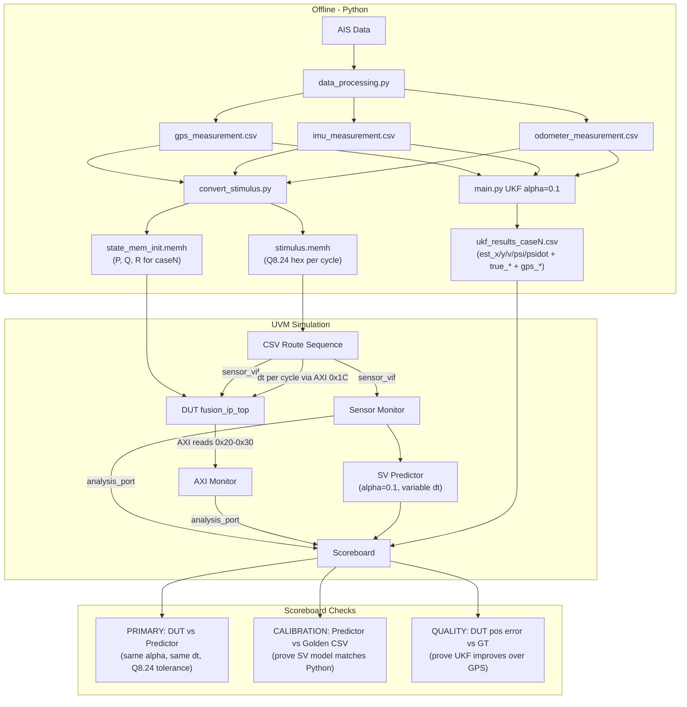

# UKF Verification Redesign Plan

## Architecture Overview




## Changes Required

### 1. RTL: Change alpha to 0.1 and add DT register

**File: `[rtl/params.vh](rtl/params.vh)`**

Change UKF tuning from alpha=1 to alpha=0.1:

- `alpha=0.1, beta=2, kappa=0` gives `lambda = 0.01*5 - 5 = -4.95`
- `gamma = sqrt(N + lambda) = sqrt(0.05) = 0.22360679...`
- `Wm[0] = lambda/(N+lambda) = -4.95/0.05 = -99.0`
- `Wc[0] = Wm[0] + (1 - alpha^2 + beta) = -99 + 2.99 = -96.01`
- `Wm[i] = Wc[i] = 1/(2*(N+lambda)) = 1/0.1 = 10.0`
- All values within Q8.24 range (+-128)

Remove `DT_Q824` constant (dt becomes runtime-configurable).

**File: `[rtl/fusion_ip_top.sv](rtl/fusion_ip_top.sv)`**

- Add `REG_DT = 8'h1C` register (gap between `ODOM_V=0x18` and `OUT_X=0x20`)
- Default value on reset: `DT_Q824` (0.04s) for backward compatibility
- Wire `reg_dt` to `predict_block.dt` instead of hardcoded constant

**File: `[rtl/predict_block.sv](rtl/predict_block.sv)`** -- no change needed (dt is already an input port)

### 2. SV Predictor: Match Python alpha=0.1, support variable dt

**File: `[tb/ukf_predictor.sv](tb/ukf_predictor.sv)`**

- Change `ALPHA = 0.1`, recompute `LAMBDA = -4.95`, `GAMMA = 0.22360679...`
- Change weights: `Wm[0] = -99.0`, `Wc[0] = -96.01`, `Wm[i] = Wc[i] = 10.0`
- Add `dt` parameter to `step()` function (instead of using constant `DT`)
- Update `predict_step()` to accept `dt` argument, pass through to `ctrv()`

### 3. Python: Extend golden export to full state vector

**File: `[tracking_ship/main.py](tracking_ship/main.py)`**

- Modify `save_results()` to include `est_speed`, `est_heading`, `est_yaw_rate` columns
- Also export `heading_true`, `yaw_rate_true`, `speed_true` for full GT reference

### 4. Stimulus conversion script

**New file: `scripts/convert_stimulus.py`**

Reads the 3 sensor CSVs + tuning case, generates:

- `tb/golden/stimulus.csv` — per-cycle: step, gps_x_hex, gps_y_hex, gps_valid, imu_psi_hex, imu_dot_hex, imu_valid, odom_v_hex, odom_valid, dt_hex, gt_x, gt_y (float for scoreboard GT check)
- `tb/golden/state_mem_init.memh` — P/Q/R matrices for specified case in Q8.24
- Copies memh to `tb/state_mem_init.memh` for direct simulation

### 5. Scoreboard redesign

**File: `[tb/fusion_scoreboard.sv](tb/fusion_scoreboard.sv)`**

Three-tier comparison:

- **PRIMARY (DUT vs Predictor)**: Every cycle. Compares all 5 states. Uses Q8.24 error threshold (configurable, default ~0.5). Reports MATCH/MISMATCH.
- **CALIBRATION (Predictor vs Golden CSV)**: Per cycle, if golden queue has data. Compares predictor est_x/y/v/psi/psidot vs Python CSV values. Threshold wider (float vs fixed-point). Validates SV model correctness.
- **QUALITY (DUT vs GT)**: Compares DUT position (x,y) vs AIS ground truth. Also compares GPS error vs GT. Reports RMSE, improvement %, proves UKF works.

report_phase output:

```
[SB_REPORT] PRIMARY:     N cycles, M mismatches (DUT vs Predictor, thresh=0.5)
[SB_REPORT] CALIBRATION: N cycles, Pred_vs_Golden_RMSE=X.XXX (SV model validated)
[SB_REPORT] QUALITY:     DUT_RMSE=X.XXX m, GPS_RMSE=X.XXX m, Improvement=XX.X%
[SB_SUMMARY] Test PASSED/FAILED
```

### 6. CSV sequence update

**File: `[sequences/csv_route_sequence.sv](sequences/csv_route_sequence.sv)`**

- Read `stimulus.csv` (new format with dt_hex column)
- Read `golden_expected.csv` (Python UKF est for calibration check)
- For each cycle:
  1. Write `dt_hex` to AXI register `0x1C`
  2. Drive sensor data via `sensor_vif`
  3. Trigger UKF, poll, read outputs
  4. Push golden ref (gt_x/y, gps_x/y, sw_est all 5 states) to scoreboard

### 7. Testbench and test updates

**File: `[tb/tb_fusion_ip.sv](tb/tb_fusion_ip.sv)`** — add `0x1C` to AXI VIF mapping if needed

**File: `[testcases/fusion_tests.sv](testcases/fusion_tests.sv)`** — T1/T2 tests update `DT` value via AXI write before triggering, or use default

### Key constraint: Q8.24 range check

With Python tuning case 0 (Nominal):

- `P0 diag = [625, 625, 2.25, 0.0225, 0.0025]` — P0[0,0]=625 **exceeds Q8.24 max of 128**
- Need to clamp or scale P0 for RTL; flag in conversion script
- Cases 3 (P0*0.01), 5 (P0*1) have the same P0 overflow issue

This needs a decision: either accept clamped P0 in RTL (with warning), or scale P0 down.